<p align="center">
  
</p>

<p align="center">
  <b>A Telegram trading assistant that turns free market data into explainable confluence.</b><br>
  Entry, stop and targets on demand · live alerts per pair · market-wide autopilot · fundamentals with a verdict.
</p>

<p align="center">
  
  
  
  
  
  
</p>

<p align="center">
  <a href="https://t.me/ezytradeai_bot"></a>
  &nbsp;
  <a href="https://printezy.money/ezyai"></a>
  &nbsp;
  <a href="#deploy"></a>
</p>

<br>

## 🧭 Contents

- ✨ [Features](#features)
- 🌐 [Markets & data](#markets)
- 🎛️ [Styles & risk modes](#styles)
- ⌨️ [Commands](#commands)
- 💎 [PRO](#pro)
- 🚀 [Quick start](#quickstart)
- ⚙️ [Configuration](#config)
- ☁️ [Deploy to Fly.io](#deploy)
- 🏗️ [Architecture](#architecture)
- ⚠️ [Disclaimer](#️-disclaimer)

<br>

<a name="features"></a>


<br>

Every feature works two ways: tap the inline buttons under any message, or type the command. Flows are guided (pair → style → risk mode) with Back and Cancel at every step.

<table>
  <tr>
    <td width="33%" valign="top">
      <h3>📈 Analyze</h3>
      Trend, support and resistance, an entry zone, stop, two targets, risk-reward and a setup score, with the reasons spelled out.<br><br><code>/analyze BTCUSD</code>
    </td>
    <td width="33%" valign="top">
      <h3>🔔 Watch</h3>
      Live alerts for one pair. Watch the same pair as a scalp, an intraday move and a swing at once, each with its own cadence and history.<br><br><code>/watch XAUUSD scalping normal</code>
    </td>
    <td width="33%" valign="top">
      <h3>🤖 Autopilot</h3>
      Scans the whole universe on a rotating cursor and sends only the best setup that clears the bar. One scanner per style, scoped to the asset classes you want.<br><br><code>/autopilot swing safe -stocks</code>
    </td>
  </tr>
  <tr>
    <td valign="top">
      <h3>📊 Fundamentals</h3>
      Range position, trend structure, realized volatility, CFTC positioning, macro drivers for the metals, statement scores and DCF for stocks, headline mood, and a written verdict.<br><br><code>/fundamentals XAUUSD</code>
    </td>
    <td valign="top">
      <h3>💲 Quote</h3>
      Live price, day range bar, 24h change and volume, stamped with the feed that served it.<br><br><code>/quote ETHUSD</code>
    </td>
    <td valign="top">
      <h3>📋 Dashboard</h3>
      Watches, autopilots, feed mode and plan in one card, with a refresh button and the shortcut menu.<br><br><code>/dashboard</code>
    </td>
  </tr>
</table>

<br>

<details>
<summary><b>🧠 How a signal is built</b> &nbsp;·&nbsp; click to expand</summary>

Signals are rule-based confluence, deterministic and explainable. No model, no black box.

| Layer | What it does |
| --- | --- |
| **Trend** | EMA 9 / 21 / 50 alignment, ADX strength, a higher-timeframe direction check and a confirmation timeframe |
| **Momentum** | RSI, MACD histogram, stochastic, Bollinger position |
| **Levels** | Swing highs and lows clustered into support and resistance, used for the entry zone and targets |
| **Risk** | ATR-based stop and targets, the mode's risk per trade and R:R floor, spread widened into the stop |
| **Score** | Aligned indicators counted into a 0 to 100 setup score, gated per style and mode |

Before any of that runs, the data has to pass four gates. Degraded data is skipped, never analysed silently.

| Gate | Rule |
| --- | --- |
| ⏱️ **Freshness** | The last bar must be younger than 4× its timeframe (3.5× for daily). Gaps and implausible prints are rejected too. |
| 🕰️ **Session** | Scalping runs only inside the pair's liquidity window (see [Styles & risk modes](#styles)). Outside it the bot says so and names the next open. |
| 📏 **Spread** | A static per-class spread estimate widens the stop and drops any setup whose R:R it would eat. |
| 🚫 **Synthetic** | Demo data can never back a live signal, for any style. |

A calendar blackout pauses watches and autopilot around high-impact economic releases. Every signal is tracked to its outcome, so `/stats` and `/calibration` show how the setup score has actually performed.

</details>

<br>

<a name="markets"></a>


<br>

Nothing here needs a paid feed, an account or an API key.

| Market | Universe | Primary feed | Fallback | Tier |
| --- | :---: | --- | --- | :---: |
| 🪙 **Crypto** | 30 pairs | Binance public API, multi-host | ccxt on Kraken and Coinbase | realtime |
| 🥇 **Gold** | XAUUSD | Binance tokenized spot (PAXG), around the clock | GC=F futures on Yahoo | realtime |
| 🥈 **Metals, energy, indices** | 9 CFDs | Yahoo Finance chart API | — | delayed |
| 💱 **Forex** | 10 majors and crosses | Yahoo Finance chart API | — | delayed |
| 🏢 **Stocks & ETFs** | 22 tickers | Yahoo Finance chart API | — | delayed |

Examples: `BTCUSD` `ETHUSD` `SOLUSD` · `XAUUSD` `XAGUSD` `WTI` `US30` `NAS100` `SPX500` · `EURUSD` `GBPUSD` `USDJPY` · `AAPL` `NVDA` `TSLA`

> **Why tokenized gold?** Yahoo has no spot gold ticker, and the futures book thins out overnight and shuts on CME holidays. PAXG is one vaulted ounce per token, trades within a fraction of a percent of spot, and never sleeps. If it fails to serve, gold falls back to the futures automatically.

Every candle is stamped with the provider that served it, so the quality gate can verify provenance at the moment a signal goes out. Set `EZYAI_DEMO_DATA=true` for a deterministic synthetic fallback in offline demos and tests.

<br>

<a name="styles"></a>


<br>

A **style** sets the timeframes and how often a watch is checked. A **mode** sets how much risk each trade takes and how many signals a day are allowed.

| Style | Chart | Trend from | Checked every | Holds for |
| --- | :---: | :---: | :---: | :---: |
| ⚡ Scalping | 5m | 15m | 1 min | minutes |
| 🌤️ Intraday | 15m | 1h | 5 min | hours |
| 🌊 Swing | 1d | 1d | 30 min | days |

| Mode | Risk per trade | R:R target | Signals per day |
| --- | :---: | :---: | :---: |
| 🛡️ Safe | 0.5% | 2.5 | 3 |
| ⚖️ Normal | 1.0% | 2.0 | 6 |
| 🔥 Aggressive | 2.0% | 1.5 | 10 |

**Scalping windows** (UTC, weekdays). Outside the window a scalp is refused as schedule, not as a data failure.

| Instruments | Window | Preferred |
| --- | :---: | :---: |
| 🥇 Gold (spot feed) | 00:00 – 21:00 | 12:00 – 16:00 |
| 💱 FX majors | 07:00 – 21:00 | 12:00 – 16:00 |
| 🥈 Silver, energy, GER40, FX crosses | 07:00 – 16:00 | 12:00 – 16:00 |
| 🇺🇸 US30, NAS100, SPX500 | 13:30 – 20:00 | 13:30 – 17:00 |
| 🪙 Crypto | always open | — |

Single stocks never scalp: the cash session, the quote lag and the overnight gap make scalp-level levels meaningless.

<br>

<a name="commands"></a>


<br>

| Command | What you get | Example |
| --- | --- | --- |
| 🔍 `/analyze` | Full market analysis with entry, stop and targets | `/analyze BTCUSD` |
| 💲 `/quote PAIR` | Live price and day range | `/quote ETHUSD` |
| 📊 `/fundamentals PAIR` | Research card with a verdict and reading links | `/fundamentals AAPL` |
| 🔔 `/watch PAIR STYLE MODE` | Live alerts for a pair · PRO | `/watch EURUSD intraday safe` |
| 👀 `/watches` | Your watch list, with a remove button per row | `/watches` |
| ❌ `/unwatch PAIR [STYLE]` | Stop one style, or every style on the pair | `/unwatch XAUUSD scalping` |
| 🤖 `/autopilot STYLE MODE [-crypto -stocks …]` | Market-wide auto signals, scoped by class · PRO | `/autopilot swing normal -stocks` |
| ⏹️ `/stopautopilot [STYLE]` | Stop one scanner, or all of them | `/stopautopilot swing` |
| 📋 `/dashboard` | Everything at a glance | `/dashboard` |
| 👤 `/account` | Plan, watches and autopilot status | `/account` |
| 💎 `/plans` | Trial and PRO plans | `/plans` |
| 🎟️ `/redeem CODE` | Activate PRO bought on the website or a gift code | `/redeem EZY-AB12-CD34` |
| 📖 `/help` | The command list | `/help` |

Limits per account: **10 watches**, **30 watch alerts a day**, **40 taps or commands a minute**. Autopilot daily limits reset at midnight UTC.

<details>
<summary><b>🛠️ Admin and operator commands</b> &nbsp;·&nbsp; click to expand</summary>

Only the `ADMIN_TELEGRAM_ID` chat can use these.

| Command | Purpose |
| --- | --- |
| `/stats` | Signal outcomes: hit rate, expectancy and counts per style and mode |
| `/calibration` | How the setup score has performed against results, by score bucket |
| `/verifyfeed PAIR` | One-shot feed diagnostics: venue symbol, provider, tier, freshness, session window |
| `/export` | DMs the current state file as an off-box backup |
| `/mkcode 1mo [COUNT] [USES] [VALID_DAYS]` | Mint free-month gift codes |
| `/mkcode trial DAYS [COUNT] [USES] [VALID_DAYS]` | Mint free PRO-day codes |
| `/mkcode off PERCENT [COUNT] [USES] [VALID_DAYS]` | Mint percent-off codes for the next purchase |
| `/codes` · `/revokecode CODE` | List live codes · kill one |
| `/settrial [DAYS]` | Show or change the free-trial length (1 to 30) for new accounts |

</details>

<details>
<summary><b>💡 Usage examples</b> &nbsp;·&nbsp; click to expand</summary>

```text
/analyze BTCUSD                    → then pick style and risk mode from the buttons
/watch XAUUSD scalping normal
/watch XAUUSD intraday normal      → both watches run side by side
/watch AAPL swing aggressive
/unwatch XAUUSD                    → clears every style on the pair
/fundamentals SOLUSD
/autopilot scalping aggressive -stocks -forex
/autopilot swing safe              → a second scanner, different style
/stopautopilot scalping
/quote ETHUSD
```

</details>

<br>

<a name="pro"></a>


<br>

**Free** gets Analyze, Quote and the dashboard preview. **PRO** unlocks live Watch alerts, Autopilot, and the deep Fundamentals card: scores, DCF fair value, COT positioning, macro verdict and outlook.

<table align="center">
  <tr>
    <th>Plan</th><th>Card</th><th>Telegram Stars</th><th></th>
  </tr>
  <tr>
    <td>1 month</td><td align="center">$14.99</td><td align="center">750 ⭐</td><td></td>
  </tr>
  <tr>
    <td><b>6 months</b></td><td align="center"><b>$44.99</b></td><td align="center"><b>2250 ⭐</b></td><td>🏆 most popular · save 50%</td>
  </tr>
  <tr>
    <td>12 months</td><td align="center">$99.99</td><td align="center">5000 ⭐</td><td>save 44%</td>
  </tr>
</table>

<p align="center">🎁 <b>3-day free trial</b>, once per user. Expiry downgrades automatically; watches stay stored and resume on PRO.</p>

| Method | How it works |
| --- | --- |
| ⭐ **Telegram Stars** | Invoice inside Telegram, activated the moment it is paid |
| 💳 **Card in the bot** | Native Stripe Checkout with dynamic prices, activated by webhook at `/webhook/stripe` |
| 🌐 **Card on the website** | Buy at [printezy.money/ezyai](https://printezy.money/ezyai), then `/redeem` the one-time code from the success page or receipt. The bot also claims purchases by Telegram username and sweeps unclaimed rows every two minutes. Activation is idempotent on the Stripe session id. |
| ₮ **USDT (TRC-20)** | Manual transfer with a screenshot; the admin approves or denies with one tap |

<details>
<summary><b>🎟️ Promo and gift codes</b> &nbsp;·&nbsp; click to expand</summary>

Two independent kinds.

- **Discounts on card checkout.** Create a coupon and a promotion code in the Stripe Dashboard (Products → Coupons → New → Promotion code). The Checkout page shows an "Add promotion code" field, so nothing else is needed.
- **Codes minted in Telegram by the admin.** `/mkcode 1mo 5` makes five single-use one-month codes valid 90 days. `/mkcode trial 7 10` makes ten 7-day codes. `/mkcode off 20 50` makes fifty 20%-off codes; once redeemed, `/plans`, Stars, card and USDT all show the reduced price, and the discount is spent by the next completed purchase. Customers activate any code with `/redeem CODE`; the bot checks its own codes before asking the website.

Redeem codes tolerate spaces, lowercase, missing dashes and O/0 or I/1 mix-ups, and allow five attempts per hour per chat.

</details>

<details>
<summary><b>👥 Team access</b> &nbsp;·&nbsp; click to expand</summary>

- `PRO_ACCESS_IDS`: comma-separated chat ids that are always PRO. Editable as a Fly secret, no redeploy.
- `ADMIN_TELEGRAM_ID`: approves USDT claims, receives operator alerts, and can use the admin commands.
- The two lists are independent.

</details>

<br>

<a name="quickstart"></a>


<br>

```bash
python -m venv .venv
.venv\Scripts\activate              # Windows · source .venv/bin/activate on macOS and Linux
pip install -r requirements.txt

copy .env.example .env              # fill TELEGRAM_BOT_TOKEN from @BotFather
python main.py
```

On Windows, `start.bat` does the same from a double-click.

**Run the tests**

```bash
pip install -r requirements-dev.txt
pytest
```

The suite runs offline: every provider is stubbed, and the bot's button flows are driven through the real callback handler with fake Telegram objects.

<br>

<a name="config"></a>


<br>

Copy `.env.example` to `.env` for local runs. On Fly, set the same names with `fly secrets set`. Real environment variables always win over `.env`.

<details>
<summary><b>⚙️ Every environment variable</b> &nbsp;·&nbsp; click to expand</summary>

| Variable | Default | Purpose |
| --- | --- | --- |
| `TELEGRAM_BOT_TOKEN` | — | The bot token from @BotFather. Required. |
| `EZYAI_STATE_FILE` | `state.json` | Where watches, autopilots, plans and codes persist |
| `EZYAI_LOG_LEVEL` | `INFO` | DEBUG, INFO, WARNING or ERROR |
| `EZYAI_DEMO_DATA` | `false` | Synthetic data fallback when a live feed fails |
| `EZYAI_HEALTH_STALE_S` | `180` | `GET /` returns 503 when the scheduler has not ticked for this long |
| `EZYAI_CONTACT_EMAIL` | — | Sent to SEC EDGAR in the User-Agent, as its fair-access policy requires |
| `EZYAI_CALENDAR_URL` | ForexFactory weekly feed | Economic calendar the blackout gate polls |
| `EZYAI_CALENDAR_POLL_S` | `600` | Calendar poll interval |
| `EZYAI_SCALP_SHADOW` | `false` | Compute scalping candidates but emit nothing, to collect a practice week of live data |
| `STRIPE_API_KEY` | — | Stripe secret key for card checkout in the bot |
| `STRIPE_WEBHOOK_SECRET` | — | Signing secret for `/webhook/stripe` |
| `BOT_USERNAME` | `ezytradeai_bot` | Used in Stripe success and cancel redirects |
| `USDT_ADDRESS` | — | TRC-20 receiving address shown to manual payers |
| `ADMIN_TELEGRAM_ID` | — | Admin chat: approvals, alerts, admin commands |
| `PRO_ACCESS_IDS` | — | Comma-separated chat ids with permanent PRO |
| `EZYAI_SITE_URL` | `https://printezy.money` | Website whose entitlement API the bot claims from |
| `EZYAI_SITE_KEY` | — | Bearer key; must equal the website's `EZYAI_ENTITLEMENT_KEY`. Empty disables the bridge. |
| `EZYAI_SITE_USERNAME_MATCH` | `true` | Also claim website purchases by Telegram username. Set false once the site issues codes. |
| `SENTRY_DSN` | — | Error reporting; nothing is sent when empty |

</details>

<br>

<a name="deploy"></a>


<br>

The repo ships a `Dockerfile`, a `fly.toml` and a health endpoint, so the bot stays awake 24/7 on Fly.io's free allowance.

```bash
# 1 · install flyctl
winget install fly-io.flyctl          # Windows · brew install flyctl on macOS

# 2 · log in
fly auth login

# 3 · create the app and its persistent volume
fly launch --no-deploy                # the app name in fly.toml can be changed
fly volumes create ezyai_state --size 1

# 4 · inject secrets, never commit them
fly secrets set TELEGRAM_BOT_TOKEN="your_token_from_botfather"

# 5 · deploy
fly deploy

# 6 · watch it come up
fly logs
```

Then `/start` the bot in Telegram. State lives on the `/data` volume and survives redeploys. Register `https://<app>.fly.dev/webhook/stripe` as the Stripe webhook endpoint for the `checkout.session.completed` event if you use card checkout in the bot.

<details>
<summary><b>🛡️ Operating it reliably</b> &nbsp;·&nbsp; click to expand</summary>

- **Health.** `GET /` returns 200 only while the scheduler and the Telegram API check are fresh, 503 otherwise, so Fly restarts a wedged machine. Tune with `EZYAI_HEALTH_STALE_S`.
- **State.** Written atomically with `fsync`, with a rolling `state.json.bak` beside it. A corrupt file is moved aside as `state.json.corrupt-<ts>` and the backup loads; if that fails too, the bot starts with saves disabled and alerts the admin rather than overwriting the broken file.
- **Snapshots.** Fly keeps daily volume snapshots for 14 days (`snapshot_retention` in `fly.toml`). List them with `fly volumes snapshots list <volume-id>`. `/export` DMs the state file as an off-box backup.
- **Feeds.** A Yahoo ticker that returns 404 is remembered for six hours and skipped in favour of its fallback, so a dead symbol never burns three failed calls per analysis.
- **Errors.** Set `SENTRY_DSN` to ship exceptions to Sentry. The admin is alerted for state save failures, a feed failing repeatedly for one pair, Stripe fulfilment errors and unhandled bot errors, throttled.
- **Image.** Runs as the unprivileged `ezy` user; `docker-entrypoint.py` hands the `/data` volume to that user at start. Dependencies are pinned in `requirements.lock`; after editing `requirements.txt`, run `scripts/lock.sh` and commit both.
- **EDGAR.** Set `EZYAI_CONTACT_EMAIL` or stock fundamentals may be blocked by SEC's fair-access policy.

</details>

<br>

<a name="architecture"></a>


<br>

**Request path.** Telegram update → `Bot` handler → `DataHub` routes the pair to Binance, Yahoo or ccxt and stamps the candles → freshness and session gates → `analysis.strategy` builds the confluence and the spec → `signals.engine` decides whether it clears the bar → `Service` schedules watches and autopilots, dedups on lifecycle, tracks outcomes → `formatting.message` renders the card.

<details>
<summary><b>🗂️ Project layout</b> &nbsp;·&nbsp; click to expand</summary>

```text
app/
  bot.py                  Telegram handlers, guided button flows, rate limit
  ui.py                   inline keyboards and the callback scheme
  constants.py            styles, modes, universes, sessions, plans, asset classes
  config.py               environment and infra config
  billing.py              plans, Stars invoices, Stripe checkout, USDT, discounts
  site_entitlements.py    claims PRO bought on the website (codes, usernames, sweep)
  health.py               liveness beats behind GET /
  analysis/               indicators, levels, regime and session logic, strategy
  data/                   Binance / Yahoo / ccxt / synthetic providers, DataHub,
                          freshness and quality gates, economic calendar, feed probe
  signals/                signal engine, autopilot scanner, watch and autopilot scheduler
  outcomes/               signal outcome tracking, stats and calibration
  risk/                   position sizing helpers
  fundamentals/           CoinGecko, EDGAR, derived stats, COT, macro, scoring, news
  formatting/             HTML card renderers
main.py                   entry point: bot, scheduler, health server, Stripe webhook
docker-entrypoint.py      hands the /data volume to the unprivileged user
scripts/                  backtest, calibrate, tune, lock
tests/                    pytest suite, fully offline
```

</details>

<br>


## ⚠️ Disclaimer

EzyAi produces educational confluence, not financial advice. Signals are rule-based and explainable, but no rule set predicts markets. Verify every price with your broker before acting, and never risk money you cannot afford to lose.

<p align="center">
  <sub>MIT licensed · Built for Telegram · <a href="#-contents">Back to top ↑</a></sub>
</p>
